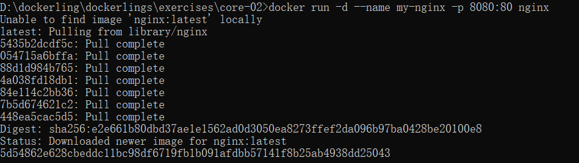
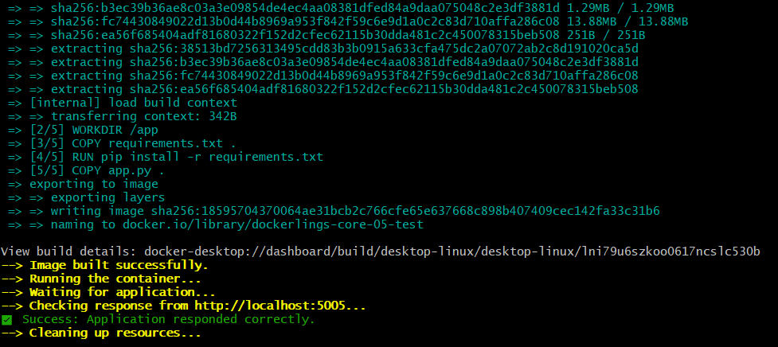

参考资料：
[veggiemonk/awesome-docker: :whale: A curated list of Docker resources and projects](https://github.com/veggiemonk/awesome-docker)

[Build your own Docker | CodeCrafters](https://app.codecrafters.io/courses/docker/overview)
[codecrafters-io/build-your-own-x: Master programming by recreating your favorite technologies from scratch.](https://github.com/codecrafters-io/build-your-own-x)

[Linux containers in 500 lines of code](https://blog.lizzie.io/linux-containers-in-500-loc.html)
[barco: Linux Containers From Scratch in C. | Blog | Luca Cavallin](https://www.lucavall.in/blog/barco-linux-containers-from-scratch-in-c)


| 场景                            | 推荐方案       | 原因                                     |
| ----------------------------- | ---------- | -------------------------------------- |
| 数据库数据（PostgreSQL/MySQL/Redis） | Volume     | 需要高 IO 性能、权限隔离、Docker 自动备份/迁移          |
| 应用运行时产生的日志/缓存                 | Volume     | 容器专属，不污染宿主机目录结构                        |
| 开发时修改源代码                      | Bind Mount | `./src:/app/src`，改完热重载，无需重新 build      |
| 配置文件（nginx.conf / .env）       | Bind Mount | 宿主机直接编辑，容器实时读取                         |
| 需要宿主机工具查看/备份的数据               | Bind Mount | 路径明确，可用 `robocopy` / `rsync` / 压缩包直接操作 |


1.简单了解 docker的功能和用法

[furkan/dockerlings: learn docker in your terminal, with bite sized exercises](https://github.com/furkan/dockerlings)
打算直接把这个做一遍

**core-01**:
直接修改echo后面的内容就行
```docker file
# Use the emptiest possible base image
FROM docker.1ms.run/library/alpine:latest

# TODO: Fix this command to output "Hello Docker"
CMD ["echo", "Hello Docker"]

```
然后`docker build -t hello-docker .`(-t指定名称)、`docker run --rm hello-docker`(直接--rm，容器退出后自动删除该容器)

**core-02**:

直接执行：docker run -d --name my-nginx -p 8080:80 nginx (-d:后台运行)(可以直接run，如果找不到image就会自动pull)

验证结果：
```cmd
docker ps
curl http://localhost:8080
```

验证完成后docker stop my-nginx、docker rm my-nginx

**core-03**:
使用docker logs查看日志并保存为logs.txt `docker logs my-logger>>logs.txt`

**core-04**:
使用`docker cp`在宿主机和容器间传输文件：
`D:\dockerling\dockerlings\exercises\core-04>docker cp run-inside-container.sh c4-container:/tmp/~`
Successfully copied 2.05kB to c4-container:/tmp/
在容器里执行命令`docker exec`：
`docker exec c4-container sh -c "nginx -v > /tmp/container-info.txt 2>&1"`

**core-05**:
创建一个自己的dockerfile，dockerfile is a sequence of instructions。
`FROM python:3.9-slim`: Specifies the starting image for your build.
`WORKDIR /app`: Sets the current directory for all subsequent commands (`COPY`, `RUN`, `CMD`). (如果不设置，那么默认为根目录)
`COPY <source> <destination>`: Copies files from your host into the image.
Tip: To optimize build caching, you should copy `requirements.txt` and run `pip install` before copying the rest of your application code.
 `RUN <command>`: Executes a command during the image build. This is used for installing dependencies. `RUN pip install -r requirements.txt` 
 `EXPOSE 5000`: Informs Docker that the application listens on this port. This is good practice for documentation.
`CMD ["python", "app.py"]`: Provides the default command to execute when the container starts.
```dockerfile
FROM m.daocloud.io/docker.io/library/python:3.9-slim
(python:3.9-slim=Debian 精简版操作系统+Python 3.9 运行环境)
WORKDIR /app

COPY requirements.txt .

RUN pip install -r requirements.txt

COPY app.py .

EXPOSE 5000

CMD ["python", "app.py"]
```


**core-06**:
modify dockerfile以满足要求
`LABEL` 是给 Docker 镜像添加元数据（metadata）的指令，类似于给文件加标签
```dockerfile
FROM m.daocloud.io/docker.io/library/python:3.12-slim

# TODO: Add a LABEL with the key "org.dockerlings.author" and your name as the value.
# For example: LABEL org.dockerlings.author="your.name@example.com"

LABEL org.dockerlings.author="meteor"  (符合规范)

# TODO: Set the PORT environment variable to 8000.

ENV PORT=8000

WORKDIR /app

COPY requirements.txt .
RUN pip install -r requirements.txt

COPY app.py .

# The application listens on the port defined by the PORT environment variable.
# TODO: EXPOSE the port defined in the ENV instruction.

EXPOSE $PORT

# TODO: Set the default command to run the application.
# The `app.py` script will automatically use the $PORT variable.

CMD["python", "app.py"]
```

**core-07**:
```dockerfile
# TODO: Start from a suitable Nginx base image.
# A good lightweight option is nginx:stable-alpine

FROM nginx:stable-alpine

# TODO: Copy the static website content from the local `html` directory
# into the correct directory inside the image where Nginx serves files.
# The default path for Nginx web content is /usr/share/nginx/html.

COPY ./html /usr/share/nginx/html(把整个文件夹复制到正确的目录)
```

**core-08**:
介绍volume的使用
`docker run -d --name c8-postgres -e POSTGRES_PASSWORD=meteor -v pgdata:/var/lib/postgresql/data postgres:16`
`docker logs c8-postgres`

CREATE TABLE:
`docker exec c8-postgres psql -U postgres -d postgres -c "CREATE TABLE dvd_rentals (title TEXT);"`(postgres 是 PostgreSQL 的默认超级管理员用户名)（psql 是 PostgreSQL 的官方命令行客户端工具，用于连接和操作 PostgreSQL 数据库）
INSERT 0 1:
`docker exec c8-postgres psql -U postgres -d postgres -c "INSERT INTO dvd_rentals (title) VALUES ('The Grand Budapest Hotel');"`
查看postgres在WSL2中的路径
`docker volume inspect pgdata`
```
"CreatedAt": "2026-04-09T06:46:54Z",
"Driver": "local",
"Labels": null,
"Mountpoint": "/var/lib/docker/volumes/pgdata/_data",
"Name": "pgdata",
"Options": null,
"Scope": "local"
}
```

在停止和移除之后`docker stop c8-postgres && docker rm c8-postgres`
重新运行一个相同参数的容器`docker run -d --name c8-postgres -e POSTGRES_PASSWORD=meteor -v pgdata:/var/lib/postgresql/data postgres:16`
查询数据`docker exec c8-postgres psql -U postgres -d postgres -c "SELECT * FROM dvd_rentals;"`
```
          title
--------------------------
 The Grand Budapest Hotel
(1 row)
```
可以看到数据保存了下来，保存在WSL2里。

**core-09**:
