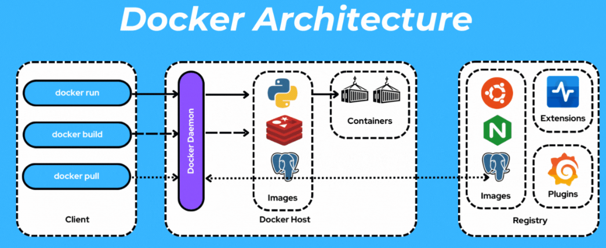
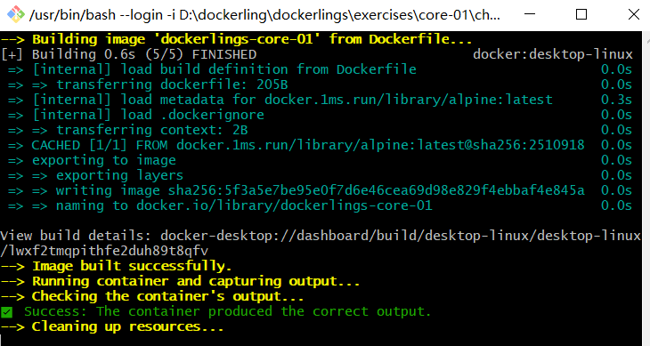
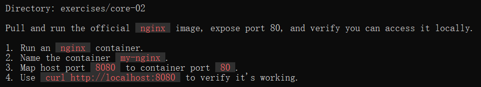
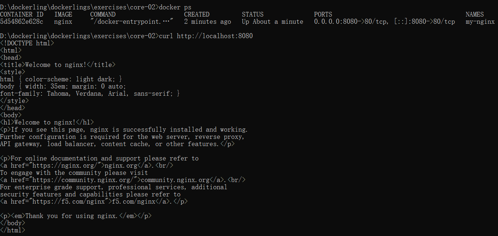
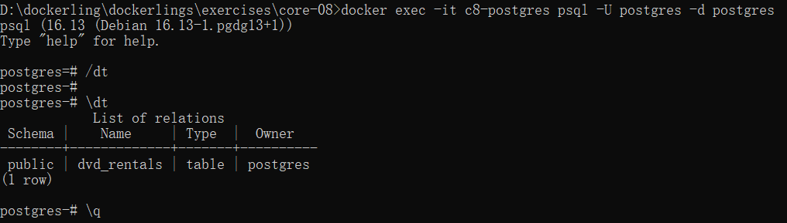
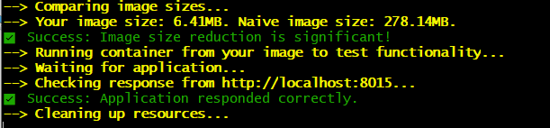

参考资料：
[veggiemonk/awesome-docker: :whale: A curated list of Docker resources and projects](https://github.com/veggiemonk/awesome-docker)

[Build your own Docker | CodeCrafters](https://app.codecrafters.io/courses/docker/overview)
[codecrafters-io/build-your-own-x: Master programming by recreating your favorite technologies from scratch.](https://github.com/codecrafters-io/build-your-own-x)

[Linux containers in 500 lines of code](https://blog.lizzie.io/linux-containers-in-500-loc.html)
[barco: Linux Containers From Scratch in C. | Blog | Luca Cavallin](https://www.lucavall.in/blog/barco-linux-containers-from-scratch-in-c)



| 场景                            | 推荐方案       | 原因                                     |
| ----------------------------- | ---------- | -------------------------------------- |
| 数据库数据（PostgreSQL/MySQL/Redis） | Volume     | 需要高 IO 性能、权限隔离、Docker 自动备份/迁移          |
| 应用运行时产生的日志/缓存                 | Volume     | 容器专属，不污染宿主机目录结构                        |
| 开发时修改源代码                      | Bind Mount | `./src:/app/src`，改完热重载，无需重新 build      |
| 配置文件（nginx.conf / .env）       | Bind Mount | 宿主机直接编辑，容器实时读取                         |
| 需要宿主机工具查看/备份的数据               | Bind Mount | 路径明确，可用 `robocopy` / `rsync` / 压缩包直接操作 |


1.简单了解 docker的功能和用法

[furkan/dockerlings: learn docker in your terminal, with bite sized exercises](https://github.com/furkan/dockerlings)
打算直接把这个做一遍

**core-01**:
直接修改echo后面的内容就行
```docker file
# Use the emptiest possible base image
FROM docker.1ms.run/library/alpine:latest

# TODO: Fix this command to output "Hello Docker"
CMD ["echo", "Hello Docker"]

```
然后`docker build -t hello-docker .`(-t指定名称)、`docker run --rm hello-docker`(直接--rm，容器退出后自动删除该容器)

**core-02**:

直接执行：docker run -d --name my-nginx -p 8080:80 nginx (-d:后台运行)(可以直接run，如果找不到image就会自动pull)

验证结果：
```cmd
docker ps
curl http://localhost:8080
```

验证完成后docker stop my-nginx、docker rm my-nginx

**core-03**:
使用`docker logs`查看日志并保存为logs.txt `docker logs my-logger>>logs.txt`

**core-04**:
使用`docker cp`在宿主机和容器间传输文件：
`docker cp run-inside-container.sh c4-container:/tmp/~`
Successfully copied 2.05kB to c4-container:/tmp/
在容器里执行命令`docker exec`：
`docker exec c4-container sh -c "nginx -v > /tmp/container-info.txt 2>&1"`

**core-05**:
创建一个自己的dockerfile，dockerfile is a sequence of instructions。
`FROM python:3.9-slim`: Specifies the starting image for your build.
`WORKDIR /app`: Sets the current directory for all subsequent commands (`COPY`, `RUN`, `CMD`). (如果不设置，那么默认为根目录)
`COPY <source> <destination>`: Copies files from your host into the image.
Tip: To optimize build caching, you should copy `requirements.txt` and run `pip install` before copying the rest of your application code.
 `RUN <command>`: Executes a command during the image build. This is used for installing dependencies. `RUN pip install -r requirements.txt` 
 `EXPOSE 5000`: Informs Docker that the application listens on this port. This is good practice for documentation.
`CMD ["python", "app.py"]`: Provides the default command to execute when the container starts.
```dockerfile
FROM m.daocloud.io/docker.io/library/python:3.9-slim
(python:3.9-slim=Debian 精简版操作系统+Python 3.9 运行环境)
WORKDIR /app

COPY requirements.txt .

RUN pip install -r requirements.txt

COPY app.py .

EXPOSE 5000

CMD ["python", "app.py"]
```


**core-06**:
modify dockerfile以满足要求
`LABEL` 是给 Docker 镜像添加元数据（metadata）的指令，类似于给文件加标签
```dockerfile
FROM m.daocloud.io/docker.io/library/python:3.12-slim

# TODO: Add a LABEL with the key "org.dockerlings.author" and your name as the value.
# For example: LABEL org.dockerlings.author="your.name@example.com"

LABEL org.dockerlings.author="meteor"  (符合规范)

# TODO: Set the PORT environment variable to 8000.

ENV PORT=8000

WORKDIR /app

COPY requirements.txt .
RUN pip install -r requirements.txt

COPY app.py .

# The application listens on the port defined by the PORT environment variable.
# TODO: EXPOSE the port defined in the ENV instruction.

EXPOSE $PORT

# TODO: Set the default command to run the application.
# The `app.py` script will automatically use the $PORT variable.

CMD["python", "app.py"]
```

**core-07**:
```dockerfile
# TODO: Start from a suitable Nginx base image.
# A good lightweight option is nginx:stable-alpine

FROM nginx:stable-alpine

# TODO: Copy the static website content from the local `html` directory
# into the correct directory inside the image where Nginx serves files.
# The default path for Nginx web content is /usr/share/nginx/html.

COPY ./html /usr/share/nginx/html(把整个文件夹复制到正确的目录)
```

**core-08**:
介绍volume的使用
`docker run -d --name c8-postgres -e POSTGRES_PASSWORD=meteor -v pgdata:/var/lib/postgresql/data postgres:16`
`docker logs c8-postgres`

CREATE TABLE:
`docker exec c8-postgres psql -U postgres -d postgres -c "CREATE TABLE dvd_rentals (title TEXT);"`(postgres 是 PostgreSQL 的默认超级管理员用户名)（psql 是 PostgreSQL 的官方命令行客户端工具，用于连接和操作 PostgreSQL 数据库）
INSERT 0 1:
`docker exec c8-postgres psql -U postgres -d postgres -c "INSERT INTO dvd_rentals (title) VALUES ('The Grand Budapest Hotel');"`
查看postgres在WSL2中的路径
`docker volume inspect pgdata`
```
"CreatedAt": "2026-04-09T06:46:54Z",
"Driver": "local",
"Labels": null,
"Mountpoint": "/var/lib/docker/volumes/pgdata/_data",
"Name": "pgdata",
"Options": null,
"Scope": "local"
}
```

在停止和移除之后`docker stop c8-postgres && docker rm c8-postgres`
重新运行一个相同参数的容器`docker run -d --name c8-postgres -e POSTGRES_PASSWORD=meteor -v pgdata:/var/lib/postgresql/data postgres:16`
查询数据`docker exec c8-postgres psql -U postgres -d postgres -c "SELECT * FROM dvd_rentals;"`
```
          title
--------------------------
 The Grand Budapest Hotel
(1 row)
```
可以看到数据保存了下来，保存在WSL2里。

**core-09**:
使用bind mount
docker run -d --name c9-dev-server -p 8009:80 -v "%cd%/app:/usr/share/nginx/html:ro" nginx （使用-v <host:path>:<container:path>来执行bind mount) (cmd里，所以用%cd%获取绝对路径)（:ro表示read only）
效果：修改宿主机app/html文件，会实时反馈在live的容器里。

| 特性        | **Volume** (`-v name:/path`)                | **Bind Mount** (`-v /host/path:/container/path`) |
| :-------- | :------------------------------------------ | :----------------------------------------------- |
| **创建位置**  | Docker 管理的存储区域 (`/var/lib/docker/volumes/`) | 主机上的任意指定路径                                       |
| **语法识别**  | 冒号前是**名字**（无 `/` 或 `\`）                     | 冒号前是**绝对路径**（以 `/` 或 `C:\` 开头）                   |
| **跨平台**   | 可移植，Docker 自动处理                             | 依赖主机路径结构                                         |
| **性能**    | 在 Linux 上原生，WSL2/Mac 有额外开销                  | 直接主机文件系统访问                                       |
| **备份/迁移** | 用 `docker volume` 命令管理                      | 直接复制主机文件夹                                        |
| **权限控制**  | Docker 管理权限                                 | 继承主机权限，易出权限问题                                    |
| **适用场景**  | 数据库持久化、应用数据                                 | 开发环境代码挂载、配置文件                                    |

**core-10**:
basic networking:bridge networks，可以让多个容器在同一网络内通信
先创建网络`docker network create c10-network`，然后把两个container都使用这个网络运行，进行测试
```sh
#!/bin/bash
set -e # Exit immediately if a command exits with a non-zero status.

# This script should launch two containers on the 'c10-network'.
# The network must be created manually first with 'docker network create c10-network'.

# TODO: Run the postgres container on the network.
# Name: c10-db
# Image: postgres:14-alpine
# Network: c10-network
# Required ENV: POSTGRES_PASSWORD=mysecretpassword

docker run -d \
  --name c10-db \
  --network c10-network \
  postgres:14-alpine

# TODO: Run the busybox container on the network.
# Name: c10-app
# Image: busybox
# Network: c10-network
# Command: sleep 3600，让容器保持运行

docker run -d \
  --name c10-app \
  --network c10-network \
  busybox sleep 3600

echo "Containers are starting..."
```

**core-11**:
ports and exposure
- **`EXPOSE <port>`**: 这是一个文档说明指令。它向运行容器的人表明，容器内的应用打算监听的端口。它并不会实际打开端口或让该端口可从宿主机访问。
- **`docker run -p <host_port>:<container_port>`**: 这是一个运行时指令。它会主动创建一条网络规则，将流量从宿主机的某个端口映射到容器内的某个端口。

**core-12**:
简单了解docker compose：用来定义和运行多容器的docker应用，使用YAML文件来配置应用所需的服务、网络、volumes等。
配置一个YAML文件
```yaml
services:
  redis-server:
    image: redis:alpine
    container_name: c12-redis
    ports:
      - "6379:6379"
```
然后`docker compose up`(或者-d后台运行)

**core-13**:
使用docker compose构建一个two-service的容器。
```yaml
services:
  redis:
    image: redis:alpine
    container_name: c13-redis

  web:
    build: ./app
    container_name: c13-web
    ports:
      - "8013:5000"
    environment:
      - REDIS_HOST=redis  (为了找到redis的服务地址)
    depends_on: (redis启动后web再启动)
      - redis
```
然后`docker compose up --build`

**core-14**:
multi-service compose (volumes & networks)，在13的基础上加入自定义的network和volume
```yaml
networks:
  c14-app-net:

volumes:
  redis-data: 

services:
  redis:
    image: redis:alpine
    container_name: c14-redis
    volumes:
      - redis-data:/data  (设置容器内redis储存数据的位置)
    networks:
      - c14-app-net

  web:
    build: ./app
    container_name: c14-web
    ports:
      - "8014:5000"
    environment:
      - REDIS_HOST=redis
    depends_on:
      - redis
    networks:
      - c14-app-net
```

**core-15**:
多阶段构建，可以大幅减小最终镜像的体积。

| 示例             | 基础镜像                    | 用途   | 包含内容          |
| -------------- | ----------------------- | ---- | ------------- |
| **Builder 阶段** | `golang:1.21` (大镜像)     | 编译代码 | SDK、编译器、源码、依赖 |
| **运行阶段**       | `scratch` (空镜像)或alpine等 | 运行程序 | 只有编译好的二进制文件   |
多阶段命名：使用 `AS` 关键字给阶段命名；复制文件：用 `COPY --from=阶段名` 从其他阶段复制文件。
You use one stage (e.g., FROM golang AS builder) to compile your code, and a second, separate stage (e.g., FROM scratch) to create the final, minimal image, copying only the compiled binary from the first stage.
```dockerfile
# TODO: Refactor this Dockerfile to use a multi-stage build.
# The goal is to create a final image that is much smaller than this one.

# This single stage uses the full Go SDK, resulting in a large image.
FROM golang:1.21-alpine AS builder

WORKDIR /src

# Copy the source code and build the application
COPY app/ .
#CGO_ENABLED=0：禁用 CGO，生成静态链接的二进制文件，不依赖 C 库，适合 scratch 镜像
RUN CGO_ENABLED=0 go build -o /app/server .
#stage 2
FROM scratch
#将 /app/server 复制到当前镜像的根目录下，并命名为 /server
COPY --from=builder /app/server /server
# Expose the port the app runs on
EXPOSE 8080

# The command to run the executable
CMD ["/server"]
```

镜像体积大小从原本的278.14MB减小到了6.41MB