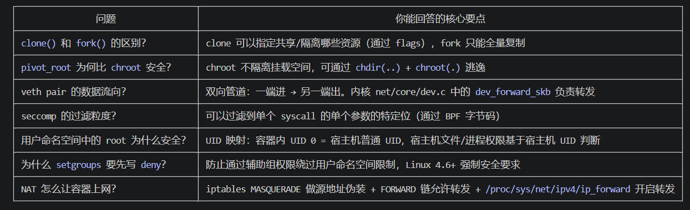
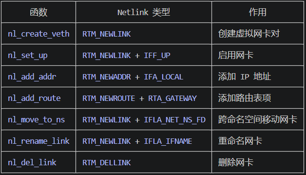
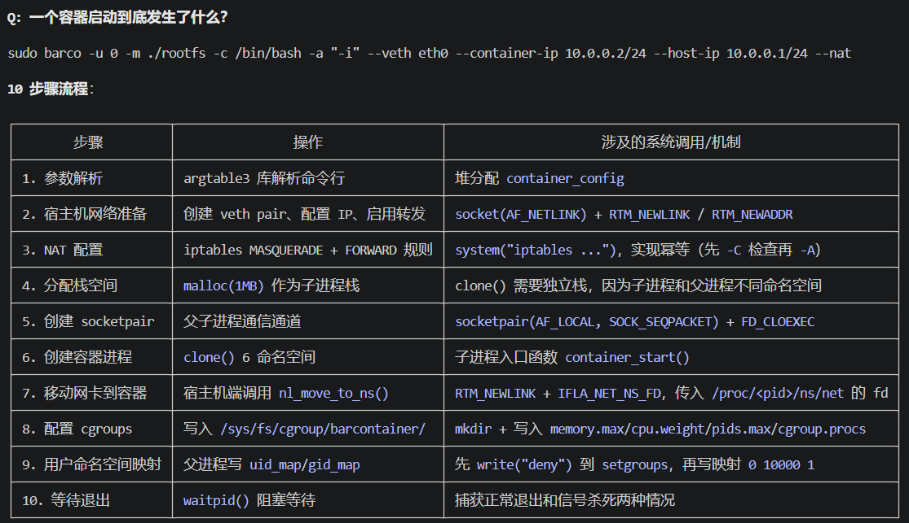
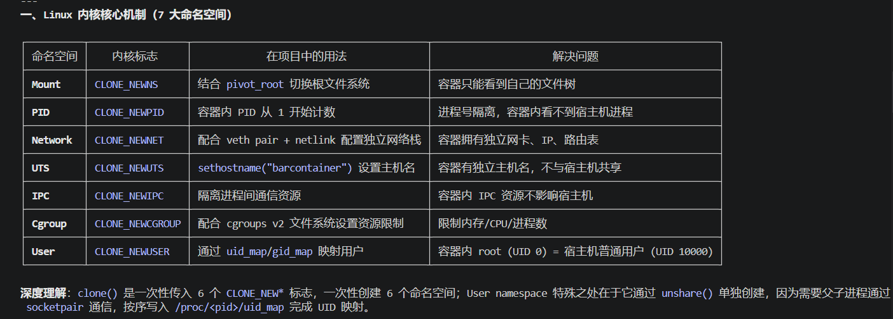

  • 深入理解 Linux 容器底层原理：7 大 Namespace、cgroups v2、pivot_root、seccomp、capabilities
  • 精通 Linux 系统编程：clone()、unshare()、mount()、prctl()、setresuid()、syscall() 等系统调用
  • 熟练使用 C 语言进行系统级编程：1500+ 行代码，涉及内存管理、文件 I/O、进程间通信
  • 掌握 Netlink 协议编程：通过 AF_NETLINK socket 直接与内核通信配置网络设备
  • 熟悉容器安全加固机制：Capabilities 权能拆分 + Seccomp 系统调用过滤双层防护
  • 工具链：clang-18、clang-tidy、clang-format、valgrind、CUnit
  • 熟悉容器安全加固机制：Capabilities 权能拆分 + Seccomp 系统调用过滤双层防护
  • 工具链：clang-18、clang-tidy、clang-format、valgrind、CUnit
  • 构建系统：Makefile（模式规则、自动变量、条件编译）

 七、cgroups v2 资源控制

  Q: 容器资源限制是怎么实现的？

  cgroups v2 的 API 就是文件系统操作：

  /sys/fs/cgroup/<container-hostname>/
  ├── memory.max      → echo "1G"     # 硬限制：超限触发 OOM Killer
  ├── cpu.weight      → echo "256"    # 相对权重（默认 100）
  ├── pids.max        → echo "64"     # 最大进程/线程数
  └── cgroup.procs    → echo "<PID>"  # 将进程加入此 cgroup

  cgroups v1 vs v2：v1 有独立层级（/sys/fs/cgroup/memory/、/sys/fs/cgroup/cpu/ 等），v2 统一在单一树中。

  cpu.weight 不是绝对限制：如果有两个 cgroup，权重分别是 100 和 256，CPU 时间按 100:256 ≈ 28%:72% 分配。这意味着当系统空闲时，容器可以使用全部
  CPU；只有在竞争时才按权重分配。

  7. socketpair 父子进程同步协议

  子进程：write(fd, &(int){0}, sizeof(int))    → 通知“我已完成 unshare”
  父进程：read(fd, ...) → 写 uid_map → 写 gid_map → write(fd, ...)  → 通知“映射完成”
  子进程：read(fd, ...) → 收到信号，继续执行

  这是一个自定义应用层协议，使用 SOCK_SEQPACKET 保证消息边界。

  4. 内存管理

  - calloc 分配并零初始化 container_config
  - asprintf 动态格式化字符串并自动分配内存
  - arg_freetable 库函数释放命令行参数表
  - free 清理所有堆分配（在 cleanup 标签处集中处理）
  - Valgrind 验证无一内存泄漏

  2. 构建系统 — Makefile 的 DAG 思维

  理解 .o → 可执行文件的依赖链：$(BARCO): format lint dir $(OBJS)，以及通配符模式规则 %.o: dir $(SRC_DIR)/%.c。

  3. 工具链完整认知

  clang-18        → 编译器前端
  clang-tidy      → 静态分析（.clang-tidy 配置文件）
  clang-format    → 代码格式化（.clang-format 配置文件）
  valgrind        → 内存泄漏检测（--leak-check=full）
  CUnit           → C 语言单元测试框架

 1. 错误处理模式 — goto cleanup

  if (socketpair(...) < 0) {
      log_fatal("socketpair failed: %m");
      exitcode = 1;
      goto cleanup;  // 跳转到统一资源释放
  }

  Linux 内核的风格——goto 用于异常路径的资源清理，回避深层嵌套的 if-else。这在内核源码（如 fs/、net/ 等子系统）中极为常见。

  五、安全加固 — 双层防护体系

  Q: 容器安全是怎么做的？

  第一层：Linux Capabilities（权能拆分）

  传统 Linux 只有 root（UID 0，全能）和非 root。Capabilities 将 root 的超能力拆成约 40 个独立能力。项目中：

  - 删除 20
  个危险能力：CAP_SYS_ADMIN（万能）、CAP_SYS_BOOT（重启）、CAP_SYS_MODULE（加载内核模块）、CAP_SYS_RAWIO（直接硬件访问）、CAP_MKNOD（创建设备文件）等     
  - 保留 15 个必要能力：CAP_NET_ADMIN（网络配置）、CAP_NET_RAW（ping）、CAP_SETUID（用户切换）等

  通过两个 prctl 操作清理：
  prctl(PR_CAPBSET_DROP, cap)     →  清空 bounding set（能力上限）
  cap_set_proc(cleaned_caps)      →  清空 inheritable set（execve 后保留的能力）

  第二层：Seccomp（系统调用过滤）

  即使保留了某些 capabilities，seccomp 可以精确到单个系统调用的过滤：

  - 阻止 chmod SUID/SGID（通过 SCMP_CMP_MASKED_EQ 比较第二个参数的特定位）
  - 阻止创建新用户命名空间（过滤 unshare/clone 中带 CLONE_NEWUSER 标志的调用）
  - 阻止 TIOCSTI 终端注入
  - 阻止 kernel keyring 操作（add_key/keyctl/request_key——因为 keyring 不是命名空间化的）
  - 阻止 ptrace/procfs 信息泄露
  - 阻止 userfaultfd（内核漏洞利用常用技术）
  - 阻止 perf_event_open（可能泄露内核地址）

  面试可以用的话术：这是纵深防御。Capabilities 做粗粒度权限拆分（"能不能做某类事"），Seccomp 做细粒度系统调用过滤（"能不能调用某个 syscall
  的特定参数组合"）。两层叠加，任一被突破都有第二层兜底。

  四、网络子系统 — Netlink 协议编程

  Q: veth pair 是怎么创建和配置的？

  Netlink 协议：用户态程序通过 AF_NETLINK socket + NETLINK_ROUTE 协议与内核通信，配置网络接口。每条消息是 nlmsghdr + ifinfomsg + 多级嵌套 rtattr（TLV     
  格式）。

  veth pair 创建（netlink.c nl_create_veth）：

  nlmsghdr (RTM_NEWLINK, NLM_F_CREATE|NLM_F_EXCL)
    └─ ifinfomsg (AF_UNSPEC)
        ├─ IFLA_IFNAME = "veth-tmp-xxx"       (主接口名)
        └─ IFLA_LINKINFO
            ├─ IFLA_INFO_KIND = "veth"         (接口类型)
            └─ IFLA_INFO_DATA
                └─ VETH_INFO_PEER             (对端信息)
                    ├─ ifinfomsg
                    └─ IFLA_IFNAME = "veth-eth0-xxx"  (对端名)

  这是嵌套的 TLV 结构——最核心的编程技巧是处理这种自描述、层级化的二进制协议。

  Netlink 操作完整 API：

 三、文件系统隔离 — pivot_root 深层理解

  Q: 为什么用 pivot_root 而不是 chroot？

  chroot 只改变进程的根目录视图，不能隔离挂载点，进程可以通过 chdir("..") + chroot(".") 逃逸。

  pivot_root 的正确步骤（mount.c 中实现）：

  1. mount(NULL, "/", NULL, MS_REC | MS_PRIVATE)
     → 将 / 设为私有挂载，阻止容器内挂载事件传播到宿主机

  2. mount(mnt, tmp_dir, NULL, MS_BIND | MS_PRIVATE)
     → bind mount：将用户指定的 rootfs 目录“镜像”到临时目录

  3. pivot_root(tmp_dir, old_root_dir)
     → 原子操作：新根 = tmp_dir，旧根被移到 old_root_dir

  4. chdir("/") → umount2(old_root, MNT_DETACH) → rmdir(old_root)
     → 卸载并删除旧根，彻底脱离宿主机文件系统

  5. mount("proc", "/proc", "proc", ...)
     → 挂载 /proc，否则 ps/top 等命令不可用

  防逃逸原理：执行 pivot_root 后，旧根的引用被移入新根下的一个子目录，此时 umount + rmdir 彻底断开连接。容器内的进程无法通过任何路径遍历到宿主机文件系统。

