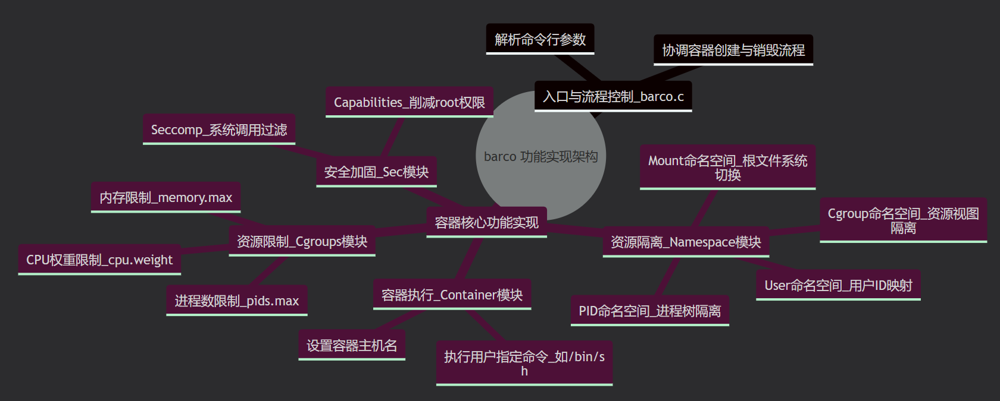
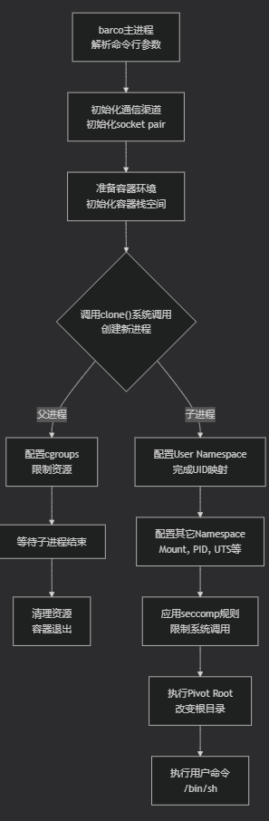
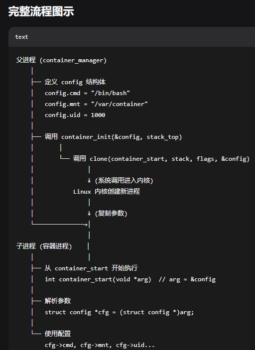
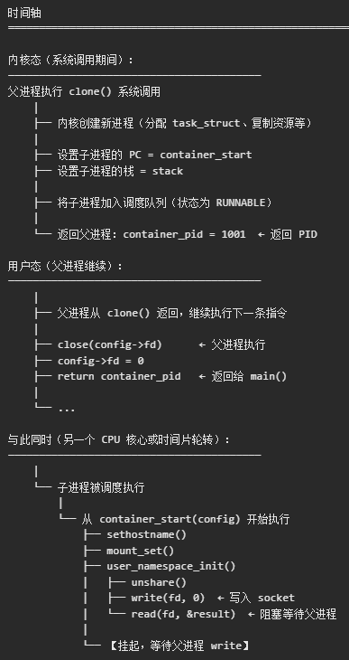
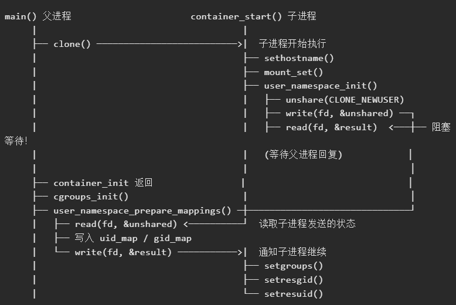
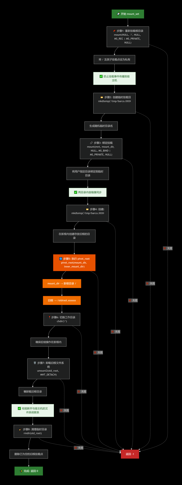

先简单了解一下概念
Kernel namespaces：
a Linux kernel feature that creates **virtual boundaries** around applications and processes, isolating them from each other while running on the same physical system.

**Namespace types**
The following table shows the namespace types available on Linux.
The second column of the table shows the flag value that is used
to specify the namespace type in various APIs.  The third column
identifies the manual page that provides details on the namespace
 type.  The last column is a summary of the resources that are
 isolated by the namespace type.  
  
Namespace              Flag                                  Isolates
─────────────────────────────────────────────────────────────
Cgroup       **CLONE_NEWCGROUP      Cgroup root directory
IPC             CLONE_NEWIPC              System V IPC,POSIX,message,queues
Network    CLONE_NEWNET             Network,devices,stacks,ports...
Mount        CLONE_NEWNS              Mount points
PID             CLONE_NEWPID             Process IDs
Time           CLONE_NEWTIME          Boot and monotonic,clocks
User           CLONE_NEWUSER           User and group IDs
UTS            CLONE_NEWUTS             Hostname and NIS domain name 

| 维度        | namespace         | cgroup            |
| --------- | ----------------- | ----------------- |
| **主要作用**  | 资源隔离，让进程看到独立的系统视图 | 资源限制和优先级控制        |
| **控制的资源** | 进程ID、网络、文件系统、用户等  | CPU、内存、磁盘IO、网络带宽等 |
| **典型功能**  | 容器有自己的PID 1、独立网络栈 | 限制容器最多用2核CPU、1G内存 |
| **缺少会怎样** | 进程能看到主机上的其他进程和设备  | 容器可能耗尽主机资源，影响其他进程 |

**cgroup（主要子系统）**：

- cpu - CPU时间分配
- memory - 内存使用限制
- blkio - 块设备IO限制
- net_cls/net_prio - 网络流量控制
- devices - 设备访问控制

---

**POSIX 标准**（可移植操作系统接口）定义的头文件：

┌─────────────────────────────────────┐
│           C 标准库（glibc）          │
├─────────────────────────────────────┤
│  <fcntl.h>    - 文件控制             │
│  <sys/types.h>- 系统类型             │
│  <unistd.h>   - POSIX 系统调用       │
│  <stdlib.h>   - 标准库函数           │
│  <stdio.h>    - 标准输入输出         │
└─────────────────────────────────────┘

|头文件|主要功能|
|---|---|
|`<sched.h>`|`clone()` 系统调用、命名空间标志位（`CLONE_NEWNS` 等）|
|`<signal.h>`|`SIGKILL`、`SIGCHLD` 等信号常量|
|`<sys/wait.h>`|`waitpid()`、`WEXITSTATUS()` 等进程等待相关|
|`<unistd.h>`|`sethostname()`、`execve()`、`close()`、`rmdir()`|
|`<linux/limits.h>`|`PATH_MAX`（路径最大长度）等 Linux 特定限制|
## **`<fcntl.h>` - 文件控制操作**

提供**文件打开、控制相关的函数和常量**：

| 类型     | 内容                             | 示例                                            |
| ------ | ------------------------------ | --------------------------------------------- |
| **函数** | `open()`, `fcntl()`, `creat()` | `open("/sys/fs/cgroup/memory.max", O_WRONLY)` |
| **常量** | 文件打开模式                         | `O_RDONLY`（只读）、`O_WRONLY`（只写）、`O_RDWR`（读写）    |
| **常量** | 文件创建标志                         | `O_CREAT`（不存在则创建）、`O_TRUNC`（截断）               |

## **`<sys/types.h>` - 系统数据类型**

定义了一些**基础的系统数据类型**（通常用于系统编程）：

|类型|实际含义|用途|
|---|---|---|
|`pid_t`|进程 ID 类型（通常是 `int`）|存储进程标识符|
|`uid_t`|用户 ID 类型（通常是 `unsigned int`）|存储用户标识符|
|`size_t`|大小类型（通常是 `unsigned long`）|表示内存大小、数组长度|
|`off_t`|文件偏移量类型|文件读写位置|

## 相关类型家族（POSIX）

| 类型        | 用途    | 典型底层            |
| :-------- | :---- | :-------------- |
| `pid_t`   | 进程 ID | `int`           |
| `uid_t`   | 用户 ID | `unsigned int`  |
| `gid_t`   | 组 ID  | `unsigned int`  |
| `off_t`   | 文件偏移  | `long long`     |
| `size_t`  | 内存大小  | `unsigned long` |
| `ssize_t` | 有符号大小 | `long`          |
## 核心 POSIX 系统调用分类

### 1. 进程控制（容器基础）

|系统调用|功能|容器场景|
|:--|:--|:--|
|`fork()`|创建子进程|生成容器内 PID 1 进程|
|`clone()`|精细化创建进程/线程|直接指定 namespace 标志（推荐用于容器）|
|`execve()`|执行新程序|子进程变为容器应用|
|`waitpid()`|等待子进程状态|容器生命周期管理|
|`kill()`|发送信号|停止/重启容器|
|`exit()`/_exit()|终止进程|清理容器进程|
|`setns()`|加入指定 namespace|进入现有容器|
|`unshare()`|脱离/创建新 namespace|创建隔离环境|
**POSIX 权限标志**，用于设置目录的访问权限：

| 宏定义       | 八进制值       | 含义      | 对目录的作用        |
| --------- | ---------- | ------- | ------------- |
| `S_IRUSR` | 0400 (256) | 所有者读权限  | 可以列出目录内容（ls）  |
| `S_IWUSR` | 0200 (128) | 所有者写权限  | 可以在目录中创建/删除文件 |
| `S_IXUSR` | 0100 (64)  | 所有者执行权限 | 可以进入目录（cd）    |


---

典型的 C 语言项目的组织方式:

**include/** - 头文件目录

- 存放公开的**头文件**（`.h` 文件）
- 这些头文件声明了函数、结构体、宏定义等接口
- 供 `src/` 目录下的源文件通过 `#include` 引用

**lib/** - 第三方库目录

- 存放项目依赖的**外部库文件**
- 可能包括：
    - 静态库（`.a` 文件）
    - 动态库（`.so` 文件）
- 也可能包含第三方库的头文件或源码

**src/** - 源代码目录

- 存放主要的**源文件**（`.c` 文件）
- 你之前看到的 `container.c`、`cgroups.c` 等应该都在这里
- 这些文件实现具体的功能逻辑，会引用 `include/` 中的头文件
- 编译后生成目标文件（`.o`）或最终的可执行文件

**tests/** - 测试代码目录

- 存放**单元测试**或**集成测试**的代码
- 用于验证 `src/` 中各个模块的功能是否正确
- 可能包含：
    - 测试用例源文件（如 `test_container.c`）
    - 测试框架相关文件
    - 测试数据和脚本

---

**栈（Stack）** 是操作系统分配给每个线程的一块**私有内存区域**，用于管理**函数调用**和**局部变量**。

它的特点是 **LIFO（后进先出）**，就像往弹匣里压子弹：最后调用的函数最先返回。

**栈里具体存什么？**

- **局部变量**：你在函数内定义的 `int a; char buf[100];`
- **函数参数**：调用函数时传递的参数（通常用寄存器传，但过多时会压栈）
- **返回地址**：函数执行完后，应该回到哪里继续执行
- **栈帧基址**：用于定位当前函数的局部变量和参数

---
指针：
- 只要函数需要**改变**传入的变量，参数就必须用指针（或 C++ 的引用）
- 结构体/类比较大时，传指针比传值高效得多
- **运行时才知道需要多大内存**，或者需要**手动控制生命周期**。`malloc`/`calloc`/`new` 返回的**一定是指针**，因为没有指针就无法访问堆上分配的内存
- 实现数据结构（链表、树、图等），这些数据结构需要节点之间互相指向，必须用指针。
- 当你需要把函数作为参数传给另一个函数时（比如排序时自定义比较规则）。
- 操作寄存器、显存、DMA 缓冲区等固定地址时必须用指针。
- C 语言的字符串是 `char*` 指向字符数组，几乎所有字符串函数都需要指针。

指向指针的指针：
比如`char **argv`，用于表示字符串数组。- 第一个 `*`：表示这是一个**指针**, 第二个 `*`：表示指针指向的内容**又是一个指针**（指向 `char`）

|方式|能力|例子|
|---|---|---|
|`char *arg`|只能传1个参数（argv[0]）|`arg = "bash"` 无法传 `-c "echo hi"`|
|`char **argv`|可传任意多个参数|`argv = {"bash", "-c", "echo hi", NULL}`|

---

**enum（枚举）** 是 C 语言中的一种用户自定义数据类型，用于定义一组**命名的整数常量**。

---
`->` 是 C 语言中**结构体指针访问成员**的操作符。
```c
// 定义结构体
struct container_config {
    int uid;
    int fd;
    char *hostname;
    // ... 其他成员
};
// 用法对比
container_config config;     // 结构体变量
container_config *ptr;       // 指向结构体的指针
config.uid = 1000;    // 结构体变量用 . 访问
ptr->uid = 1000;      // 指针用 -> 访问（等价于 (*ptr).uid）
```
---

又尝试编译了一次，莫名其妙编译成功了(唯一的改动是把英文注释让AI改成了中文注释)
meteor@DESKTOP-E75SD7O:~/barco$ `make debug=1`
```输出
2 warnings generated.
clang-18 -std=gnu17 -D _GNU_SOURCE -D __STDC_WANT_LIB_EXT1__ -Wall -Wextra -pedantic -I./include -I./lib/argtable -I./lib/log -g -O0 -lcap -lseccomp -lm -o ./bin/barco ./build/barco.o ./build/cgroups.o ./build/container.o ./build/mount.o ./build/sec.o ./build/user.o ./build/argtable3.o ./build/log.o
```
```
meteor@DESKTOP-E75SD7O:~/barco$ ls -l ./bin/barco
-rwxr-xr-x 1 meteor meteor 186664 Apr 15 11:29 ./bin/barco
meteor@DESKTOP-E75SD7O:~/barco$ sudo ./bin/barco -u 0 -m / -c /bin/sh -a .
11:31:28 INFO  ./src/barco.c:96: initializing socket pair...
11:31:28 INFO  ./src/barco.c:103: setting socket flags...
11:31:28 INFO  ./src/barco.c:112: initializing container stack...
11:31:28 INFO  ./src/barco.c:120: initializing container...
11:31:29 INFO  ./src/barco.c:131: initializing cgroups...
11:31:30 INFO  ./src/cgroups.c:101: setting memory.max to 1G...
11:31:30 INFO  ./src/cgroups.c:101: setting cpu.weight to 256...
11:31:30 INFO  ./src/cgroups.c:101: setting pids.max to 64...
11:31:30 INFO  ./src/cgroups.c:101: setting cgroup.procs to 14825...
11:31:30 INFO  ./src/barco.c:139: configuring user namespace...
11:31:30 INFO  ./src/barco.c:147: waiting for container to exit...
11:31:30 INFO  ./src/container.c:58: ### BARCONTAINER STARTING - type 'exit' to quit ###
# ls /
Docker             init               mnt                 snap       wslMjNnFM
bin                lib                opt                 srv        wslaBoHHM
bin.usr-is-merged  lib.usr-is-merged  proc                sys        wslmkhiHM
boot               lib32              root                tmp        wslmpKKjK
dev                lib64              run                 usr
etc                lost+found         sbin                var
home               media              sbin.usr-is-merged  wslIJIbHM
# ps aux
Error, do this: mount -t proc proc /proc
# mount -t proc proc /proc
mount: /proc: permission denied.
       dmesg(1) may have more information after failed mount system call.
# hostname
barcontainer
```

---
argtable3 是一个用于解析命令行参数的 C 语言库。它提供了一种声明式、结构化的方式来定义和解析命令行参数，无需手动编写复杂的解析逻辑。

核心作用

| 功能         | 说明                         |
| :--------- | :------------------------- |
| **声明式定义**  | 通过 `arg_xxx` 结构体声明参数，代码即文档 |
| **自动生成帮助** | 自动格式化输出用法说明和参数词汇表          |
| **类型安全**   | 自动将参数转换为指定类型（整数、字符串等）      |
| **错误处理**   | 自动检测参数错误并提供详细的错误信息         |
| **内存管理**   | 提供统一的内存分配和释放机制             |

代码中的典型用法
```c
// 1. 定义参数结构体
struct arg_lit *help;      // 开关型参数（如 --help）
struct arg_int *uid;       // 整数型参数（如 -u 1000）
struct arg_str *mnt;       // 字符串型参数（如 -m /path）

// 2. 初始化参数表
void *argtable[] = {
    help = arg_litn(NULL, "help", 0, 1, "显示帮助信息"),
    uid  = arg_intn("u", "uid", "<n>", 1, 1, "用户ID"),
    mnt  = arg_strn("m", "mnt", "<s>", 1, 1, "挂载目录"),
    end  = arg_end(20),    // 结束标记，最多存储20个错误
};

// 3. 解析参数
arg_parse(argc, argv, argtable);

// 4. 使用解析结果
if (help->count > 0) { ... }    // 检查参数是否提供
config.uid = uid->ival[0];      // 获取整数值
config.mnt = mnt->sval[0];      // 获取字符串值

// 5. 释放资源
arg_freetable(argtable, ...);
```
参数类型说明

|类型|用途|示例|
|:--|:--|:--|
|`arg_lit`|开关/标志选项|`-v`, `--verbose`|
|`arg_int`|整数参数|`-u 1000`, `--uid 1000`|
|`arg_str`|字符串参数|`-m /tmp`, `--mnt /tmp`|
|`arg_dbl`|浮点数参数|`--ratio 0.5`|
|`arg_file`|文件路径参数|`-o output.txt`|
|`arg_end`|结束标记+错误存储|必需放在最后|

函数命名规则

`arg_xxxn(shortopts, longopts, datatype, mincount, maxcount, glossary)`

- `mincount`/`maxcount`: 该参数最少/最多出现次数（如 `0,1` 表示可选，`1,1` 表示必需）
- `datatype`: 帮助文档中显示的参数类型占位符（如 `<n>`, `<s>`）

---
## rxi/log.c - 日志记录

|属性|说明|
|:--|:--|
|**来源**|GitHub 开源项目 `rxi/log.c`|
|**特点**|单头文件/单源文件，零依赖，轻量级|
|**功能**|分级日志输出|
**具体用途**：
- 代码中看到的 `log_info()`, `log_debug()`, `log_fatal()` 等宏
- 支持日志级别：TRACE < DEBUG < INFO < WARN < ERROR < FATAL
- 根据 `-v` 参数动态调整输出详细程度

---

|层次|技术|作用|
|:--|:--|:--|
|资源隔离|cgroups|限制 CPU/内存/IO 使用|
|命名空间隔离|clone() + flags|PID/网络/挂载/UTS 隔离|
|用户隔离|user namespace|UID/GID 映射|
|能力限制|libcap|丢弃不必要的 root 能力|
|系统调用限制|libseccomp|阻止危险 syscall|
|文件系统隔离|pivot_root/chroot|限制文件访问范围|

---
`fd` 是 **file descriptor（文件描述符）**，它是操作系统内核分配给打开文件的**整数句柄**，作为**打开文件的凭证**，**生命周期**：open() 获得 → 使用 → close() 释放，**范围**：0-1023（默认），0=stdin,1=stdout,2=stderr，**错误值**：-1 表示打开失败

---
## `sizeof` 和 `strlen` 的核心区别

|对比维度|`sizeof`|`strlen`|
|---|---|---|
|**本质**|运算符（编译时求值）|函数（运行时求值）|
|**作用**|计算对象或类型占用的**字节数**|计算字符串的**字符个数**（不含 `\0`）|
|**参数类型**|任何类型、变量、表达式|只能是 `char*`（以 `\0` 结尾的字符串）|
|**结束条件**|无（直接根据类型确定大小）|遇到第一个 `\0` 停止|
|**结果类型**|`size_t`（无符号整数）|`size_t`（无符号整数）|
|**空指针**|可以安全使用（对指针类型返回指针本身大小）|崩溃（试图访问无效内存）|

数组 vs 指针（经典陷阱）
```C
char arr[] = "Hello";
char *ptr = "Hello";
sizeof(arr);   // 6（字符 'H','e','l','l','o','\0' 共6字节）
strlen(arr);   // 5（不计 '\0'）
sizeof(ptr);   // 8（64位系统）或 4（32位系统）——指针本身大小
strlen(ptr);   // 5（字符串长度）
```
**关键点**：数组名在 `sizeof` 中不退化（保留完整数组信息），但在函数参数中会退化为指针。

字符串字面量
```C
sizeof("Hello");   // 6（包括末尾的 '\0'）
strlen("Hello");   // 5（不包括 '\0'）
```
动态内存分配
```C
char *p = malloc(100);
sizeof(p);   // 8（指针大小，不是分配的内存大小）
strlen(p);   // 未定义行为（内容没有 '\0'，可能越界）
```

---
`#define _GNU_SOURCE 1` 是一个**特性测试宏**，它的作用是告诉C标准库（特别是glibc，GNU C库）：“请开放所有GNU扩展和额外的功能，不要只局限于C标准规定的那些基础函数。”

默认情况下，为了让程序具有良好的可移植性，glibc可能不会暴露这些扩展功能。定义 `_GNU_SOURCE` 就是明确告诉glibc：“我需要这些扩展，我不在乎严格的跨平台兼容性。”

以下是这些头文件及其作用的整理表格：

|头文件|类型|主要提供的功能/声明|在该函数上下文中的作用|
|---|---|---|---|
|`"user.h"`|用户自定义|用户命名空间相关的函数声明、数据结构（如映射规则结构体）|声明 `user_namespace_prepare_mappings` 函数本身及相关的辅助类型|
|`"log.h"`|用户自定义|日志记录函数（如 `log_info`, `log_error`, `log_debug`）|记录命名空间配置过程中的错误、警告或调试信息|
|`<fcntl.h>`|系统库|`open`, `openat`, `fcntl` 函数及 `O_RDWR`, `O_CREAT`, `O_CLOEXEC` 等标志|打开 `/proc/[pid]/uid_map` 等特殊文件以准备写入映射|
|`<grp.h>`|系统库|`setgroups`, `getgrouplist` 等函数及组相关结构体 `struct group`|操作 `/proc/[pid]/setgroups` 文件，控制是否允许设置附加组（用户命名空间的安全限制）|
|`<linux/limits.h>`|系统库|Linux 特定限制常量，如 `PATH_MAX` (4096), `NAME_MAX` (255)|声明具有足够大小的路径缓冲区，安全地构造 `/proc/pid/...` 路径字符串|
|`<sched.h>`|系统库|`clone`, `unshare`, `setns` 函数及命名空间标志（如 `CLONE_NEWUSER`）|提供命名空间创建、加入等核心操作支持（虽然该函数主要准备映射，但可能调用 `unshare` 或检查命名空间状态）|
|`<stdio.h>`|系统库|`printf`, `snprintf`, `fprintf`, `perror` 等标准 I/O 函数|使用 `snprintf` 安全格式化路径字符串（如 `/proc/%d/uid_map`），输出错误信息|
|`<sys/types.h>`|系统库|基本系统类型：`pid_t`, `uid_t`, `gid_t`, `mode_t`, `size_t` 等|提供 `pid_t` 类型（函数参数）及其他系统编程所需的可移植类型|
|`<unistd.h>`|系统库|POSIX 标准函数：`read`, `write`, `close`, `getpid`, `fork`, 以及 `dprintf` 等|执行文件描述符的读写关闭操作（向 `uid_map` 写入映射数据），获取进程信息，可能的 `unshare`/`setns` 调用（部分系统）|

int unshared_flag = 0;  // 变量本身，存储数值0
&unshared_flag          // 变量在内存中的地址，比如 0x7ffeefbff5a8
在代码中的具体作用
```c
int unshared = -1;  // unshared 是一个整数变量
// &unshared 传递的是 unshared 的内存地址
read(fd, &unshared, sizeof(unshared))
//       ^^^^^^^^^ 
//       这里需要的是"往哪里写数据"的地址
```

| 对比项      | `read()`                            | `fread()`                                              |
| -------- | ----------------------------------- | ------------------------------------------------------ |
| **所属层级** | 系统调用（System Call）                   | 标准库函数（Standard Library）                                |
| **头文件**  | `<unistd.h>`                        | `<stdio.h>`                                            |
| **参数**   | `(int fd, void *buf, size_t count)` | `(void *ptr, size_t size, size_t nmemb, FILE *stream)` |
| **返回类型** | `ssize_t`（有符号）                      | `size_t`（无符号）                                          |
| **缓冲机制** | 无缓冲（直接操作内核缓冲区）                      | 用户态缓冲（提高性能）                                            |
| **性能**   | 每次调用都陷入内核，较慢                        | 批量读写，减少系统调用，较快                                         |
| **可移植性** | POSIX标准（Unix/Linux）                 | C标准（所有平台）                                              |
| **操作对象** | 文件描述符（int）                          | 文件流（FILE*）                                             |

if (表达式) {
    // 当表达式为"真"时执行
}

**真假的判定标准：**

- **真（true）**：任何**非0**的值
    
- **假（false）**：**0**

// 各种值的 ! 运算结果
!0   = 1    // 0是假，!假 = 真，真用1表示
!1   = 0    // 1是真，!真 = 假，假用0表示
!5   = 0    // 5是真，!真 = 假
!(-3) = 0   // -3是真，!真 = 假
!100 = 0    // 100是真，!真 = 假

`uid_map` 和 `gid_map` 是Linux用户命名空间中的**特殊虚拟文件**，用于配置UID/GID的映射关系。

## 一、这些文件的位置和性质


```bash
# 它们位于每个进程的/proc目录下
/proc/<PID>/uid_map    # 用户ID映射文件
/proc/<PID>/gid_map    # 组ID映射文件
# 示例
/proc/12345/uid_map
/proc/12345/gid_map
```


**重要特性：**

- 这些是**虚拟文件**（存在于内存中，不在磁盘上）
- 只能写入**一次**，写入后立即生效
- 只能写入，不能读取（权限控制）
- 只有在新的用户命名空间中才能写入






```C
struct arg_lit help;      // 普通结构体变量
struct arg_lit *p = &help; // 指向结构体的指针
// 以下两种写法等价：
help.count = 1;   // 直接访问（使用点操作符）
p->count = 1;     // 通过指针访问（使用箭头操作符）
(*p).count = 1;   // 等价写法（先解引用，再用点操作符）
```
container_init:



**`clone()` 不会在子进程阻塞时才返回**。`clone()` 的返回时机是：
1. **内核完成进程创建**（设置好 task_struct、寄存器、内存映射等）
2. **子进程被放入调度队列**
3. **立即返回 PID 给父进程**



**按位或赋值运算符 |=
#### 作用：累积错误状态

| 场景     | `exitcode` 原值 | `container_wait` 返回值 | 结果         |
| :----- | :------------ | :------------------- | :--------- |
| 一切正常   | 0             | 0                    | 0 \| 0 = 0 |
| 之前已出错  | 1             | 0                    | 1 \| 0 = 1 |
| 容器退出报错 | 0             | 1                    | 0 \| 1 = 1 |
| 双重错误   | 1             | 1                    | 1 \| 1 = 1 |


### 使用示例

```bash
# 1. 基础用法（无网络）
sudo ./bin/barco -u 1000 -m / -c /bin/bash

# 2. 启用网络（推荐）
sudo ./bin/barco -u 0 -m / -c /bin/bash --veth eth0 --container-ip 10.0.0.2/24 --host-ip 10.0.0.1/24
# veth-peer 会自动生成，如: veth-eth0-a3f9k2

# 3. 指定 veth-peer 名称
sudo ./barco \
  -u 1000 -m /tmp/rootfs -c /bin/sh \
  --veth eth0 --veth-peer veth-host \
  --container-ip 192.168.100.2/24 \
  --host-ip 192.168.100.1/24

# 4. 容器内验证网络
$ ip addr show eth0
$ ping 10.0.0.1          # 应能通宿主机
$ cat /proc/sys/net/ipv4/ip_forward  # 应为 1（如果启用转发）
```

1. `barco` does not handle network namespaces, so the container cannot access the network. Networking can roughly be setup as follows:
    
    - create a new network namespace
    - create a virtual ethernet pair
    - move one end of the pair to the new network namespace
    - assign an IP address to the interface in the new network namespace
    - setup routing and NAT
    
    In C this is usually done via the `rtnetlink` interface. Furthermore, network usage can be limited with the `net_prio` cgroup controller.

```
meteor@DESKTOP-E75SD7O:~/bar$ sudo ./bin/barco -u 0 -m / -c /bin/bash --veth eth0 --container-ip 10.0.0.2/24 --host-ip 10.0.0.1/24 -v
12:59:23 INFO  ./src/barco.c:167: network enabled: eth0(10.0.0.2/24) <-> veth-eth0-v3i9u(10.0.0.1/24)
12:59:23 DEBUG ./src/barco.c:175: creating socket pair for user namespace setup
12:59:23 DEBUG ./src/barco.c:191: allocating container stack (1048576 bytes)
12:59:23 INFO  ./src/barco.c:202: configuring host network: veth-eth0-v3i9u <- 10.0.0.1/24
12:59:23 WARN  ./src/netlink.c:283: no such interface to delete: veth-tmp-v3i9u5
12:59:23 WARN  ./src/netlink.c:283: no such interface to delete: veth-eth0-v3i9u
12:59:23 DEBUG ./src/netlink.c:180: waiting for veth interfaces to appear...
12:59:23 DEBUG ./src/netlink.c:89: interface veth-tmp-v3i9u5 ready (index=32)
12:59:23 DEBUG ./src/netlink.c:89: interface veth-eth0-v3i9u ready (index=31)
12:59:23 INFO  ./src/netlink.c:193: veth pair ready: veth-tmp-v3i9u5(index=32) <-> veth-eth0-v3i9u(index=31)
12:59:23 DEBUG ./src/netlink.c:89: interface veth-eth0-v3i9u ready (index=31)
12:59:23 DEBUG ./src/netlink.c:89: interface veth-eth0-v3i9u ready (index=31)
12:59:23 DEBUG ./src/barco.c:234: host network configured
12:59:23 INFO  ./src/barco.c:238: creating container process...
12:59:23 DEBUG ./src/container.c:178: cloning container process with flags: 0x6e020011
12:59:23 DEBUG ./src/container.c:186: container process created: pid=20716
12:59:23 DEBUG ./src/container.c:32: starting container in new namespaces
12:59:23 DEBUG ./src/mount.c:17: setting mount...
12:59:23 DEBUG ./src/mount.c:19: remounting with MS_PRIVATE...
12:59:23 DEBUG ./src/mount.c:24: remounted
12:59:23 DEBUG ./src/mount.c:26: creating temporary directory and...
12:59:23 DEBUG ./src/mount.c:33: bind mount...
12:59:23 DEBUG ./src/mount.c:39: creating inner directory...
12:59:23 DEBUG ./src/mount.c:47: pivot root with /tmp/barco.FLCUcN, /tmp/barco.FLCUcN/oldroot.bxV53L...
12:59:23 DEBUG ./src/mount.c:12: calling pivot_root syscall...
12:59:23 DEBUG ./src/mount.c:54: unmounting old root...
12:59:23 DEBUG ./src/mount.c:60: changing directory to /...
12:59:23 DEBUG ./src/mount.c:66: unmounting...
12:59:23 DEBUG ./src/mount.c:72: removing temporary directories...
12:59:23 DEBUG ./src/mount.c:83: proc mounted
12:59:23 DEBUG ./src/mount.c:85: mount set
12:59:23 DEBUG ./src/container.c:56: configuring container network: eth0 <- 10.0.0.2/24
12:59:23 DEBUG ./src/netlink.c:89: interface lo ready (index=1)
12:59:23 DEBUG ./src/container.c:67: waiting for interface veth-tmp-v3i9u5 to appear...
12:59:23 DEBUG ./src/barco.c:266: moving veth-tmp-v3i9u5 to container netns...
12:59:23 DEBUG ./src/barco.c:275: moved veth-tmp-v3i9u5 to container netns
12:59:23 DEBUG ./src/barco.c:279: initializing cgroups for pid=20716
12:59:23 DEBUG ./src/cgroups.c:77: setting cgroups...
12:59:23 DEBUG ./src/cgroups.c:90: creating /sys/fs/cgroup/barcontainer...
12:59:23 INFO  ./src/cgroups.c:118: setting memory.max to 1G...
12:59:23 DEBUG ./src/cgroups.c:127: opening /sys/fs/cgroup/barcontainer/memory.max...
12:59:23 DEBUG ./src/cgroups.c:134: writing 1G to setting
12:59:23 DEBUG ./src/cgroups.c:142: closing /sys/fs/cgroup/barcontainer/memory.max...
12:59:23 INFO  ./src/cgroups.c:118: setting cpu.weight to 256...
12:59:23 DEBUG ./src/cgroups.c:127: opening /sys/fs/cgroup/barcontainer/cpu.weight...
12:59:23 DEBUG ./src/cgroups.c:134: writing 256 to setting
12:59:23 DEBUG ./src/cgroups.c:142: closing /sys/fs/cgroup/barcontainer/cpu.weight...
12:59:23 INFO  ./src/cgroups.c:118: setting pids.max to 64...
12:59:23 DEBUG ./src/cgroups.c:127: opening /sys/fs/cgroup/barcontainer/pids.max...
12:59:23 DEBUG ./src/cgroups.c:134: writing 64 to setting
12:59:23 DEBUG ./src/cgroups.c:142: closing /sys/fs/cgroup/barcontainer/pids.max...
12:59:23 INFO  ./src/cgroups.c:118: setting cgroup.procs to 20716...
12:59:23 DEBUG ./src/cgroups.c:127: opening /sys/fs/cgroup/barcontainer/cgroup.procs...
12:59:23 DEBUG ./src/cgroups.c:134: writing 20716 to setting
12:59:23 DEBUG ./src/cgroups.c:142: closing /sys/fs/cgroup/barcontainer/cgroup.procs...
12:59:23 DEBUG ./src/cgroups.c:150: cgroups set
12:59:23 DEBUG ./src/barco.c:285: setting up user namespace mappings
12:59:23 DEBUG ./src/user.c:71: updating uid_map / gid_map...
12:59:23 DEBUG ./src/user.c:72: retrieving user namespaces status...
12:59:23 DEBUG ./src/container.c:76: interface veth-tmp-v3i9u5 is now visible
12:59:23 DEBUG ./src/container.c:84: renamed to eth0
12:59:23 DEBUG ./src/netlink.c:89: interface eth0 ready (index=32)
12:59:23 DEBUG ./src/netlink.c:89: interface eth0 ready (index=32)
12:59:23 DEBUG ./src/container.c:116: default route added via 10.0.0.1
12:59:23 INFO  ./src/container.c:121: network configured: eth0 (10.0.0.2/24) <-> host
12:59:23 DEBUG ./src/user.c:24: setting user namespace...
12:59:23 DEBUG ./src/user.c:31: writing to socket...
12:59:23 DEBUG ./src/user.c:37: reading from socket...
12:59:23 DEBUG ./src/user.c:81: user namespaces enabled
12:59:23 DEBUG ./src/user.c:102: writing uid_map / gid_map...
12:59:23 DEBUG ./src/user.c:110: writing /proc/20716/uid_map...
12:59:23 DEBUG ./src/user.c:116: writing settings...
12:59:23 DEBUG ./src/user.c:110: writing /proc/20716/gid_map...
12:59:23 DEBUG ./src/user.c:116: writing settings...
12:59:23 DEBUG ./src/user.c:127: uid_map and gid_map updated
12:59:23 DEBUG ./src/user.c:134: updating socket...
12:59:23 INFO  ./src/barco.c:294: container running (pid=20716), waiting...
12:59:23 DEBUG ./src/user.c:49: switching to uid 0 / gid 0...
12:59:23 DEBUG ./src/user.c:55: current uid after mapping: 0
12:59:23 DEBUG ./src/user.c:56: user namespace set
12:59:23 DEBUG ./src/sec.c:89: setting capabilities...
12:59:23 DEBUG ./src/sec.c:98: dropping bounding capabilities...
12:59:23 DEBUG ./src/sec.c:106: dropping inheritable capabilities...
12:59:23 DEBUG ./src/sec.c:120: freeing caps...
12:59:23 DEBUG ./src/sec.c:122: capabilities set
12:59:23 DEBUG ./src/sec.c:204: setting syscalls...
12:59:23 DEBUG ./src/sec.c:274: releasing seccomp context...
12:59:23 DEBUG ./src/sec.c:276: syscalls set
12:59:23 DEBUG ./src/container.c:144: closing container socket...
12:59:23 DEBUG ./src/container.c:152: executing: /bin/bash  (cwd: /)
12:59:23 INFO  ./src/container.c:153: ### BARCONTAINER STARTED - type 'exit' to quit ###
bash: /root/.bashrc: Permission denied
root@barcontainer:/# ls
Docker             init               mnt                 snap       wslMjNnFM
bin                lib                opt                 srv        wslaBoHHM
bin.usr-is-merged  lib.usr-is-merged  proc                sys        wslmkhiHM
boot               lib32              root                tmp        wslmpKKjK
dev                lib64              run                 usr
etc                lost+found         sbin                var
home               media              sbin.usr-is-merged  wslIJIbHM
root@barcontainer:/# ip addr
1: lo: <LOOPBACK,UP,LOWER_UP> mtu 65536 qdisc noqueue state UNKNOWN group default qlen 1000
    link/loopback 00:00:00:00:00:00 brd 00:00:00:00:00:00
    inet 127.0.0.1/8 scope host lo
       valid_lft forever preferred_lft forever
    inet6 ::1/128 scope host 
       valid_lft forever preferred_lft forever
32: eth0@if31: <BROADCAST,MULTICAST,UP,LOWER_UP> mtu 1500 qdisc noqueue state UP group default qlen 1000
    link/ether 2e:c8:4c:d3:84:67 brd ff:ff:ff:ff:ff:ff link-netnsid 0
    inet 10.0.0.2/24 scope global eth0
       valid_lft forever preferred_lft forever
    inet6 fe80::2cc8:4cff:fed3:8467/64 scope link 
       valid_lft forever preferred_lft forever
root@barcontainer:/# exit
exit
13:00:56 INFO  ./src/barco.c:315: container exited with code 0
13:00:56 DEBUG ./src/barco.c:325: container finished with exit code: 0
13:00:56 INFO  ./src/barco.c:328: freeing resources...
13:00:56 INFO  ./src/barco.c:332: removing veth peer: veth-eth0-v3i9u
13:00:57 ERROR ./src/netlink.c:56: recvmsg timed out
13:00:57 WARN  ./src/barco.c:334: failed to remove veth peer veth-eth0-v3i9u
13:00:57 INFO  ./src/barco.c:353: cleaning up cgroups for barcontainer
13:00:57 DEBUG ./src/cgroups.c:170: freeing cgroups...
13:00:57 DEBUG ./src/cgroups.c:178: removing /sys/fs/cgroup/barcontainer...
13:00:57 DEBUG ./src/cgroups.c:185: cgroups released
13:00:57 INFO  ./src/barco.c:367: so long and thanks for all the fish (exit code: 0)
```

